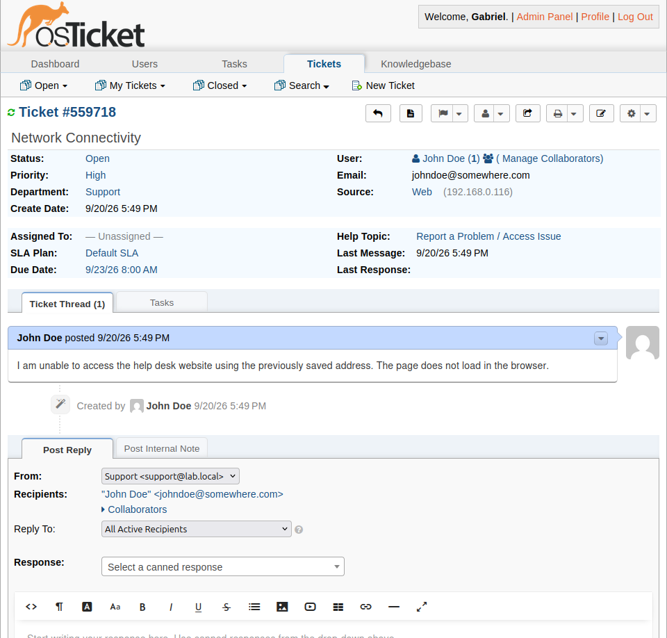
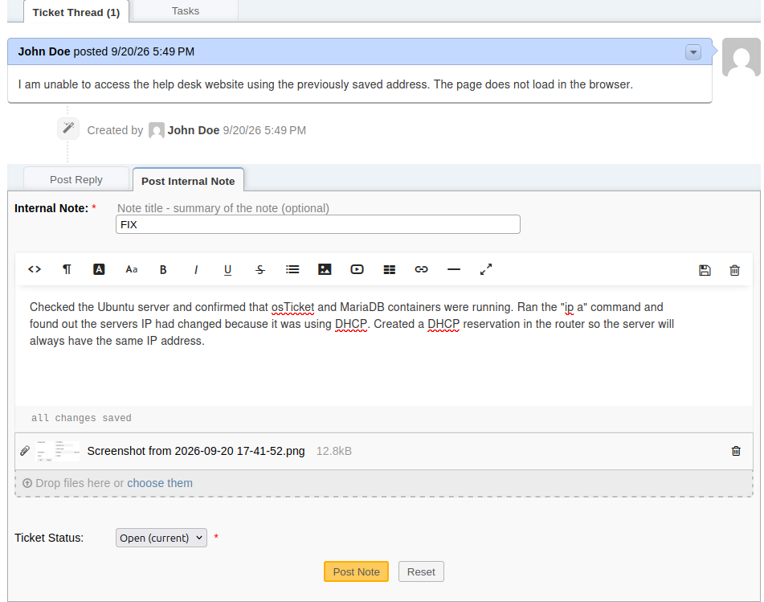
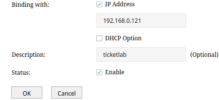
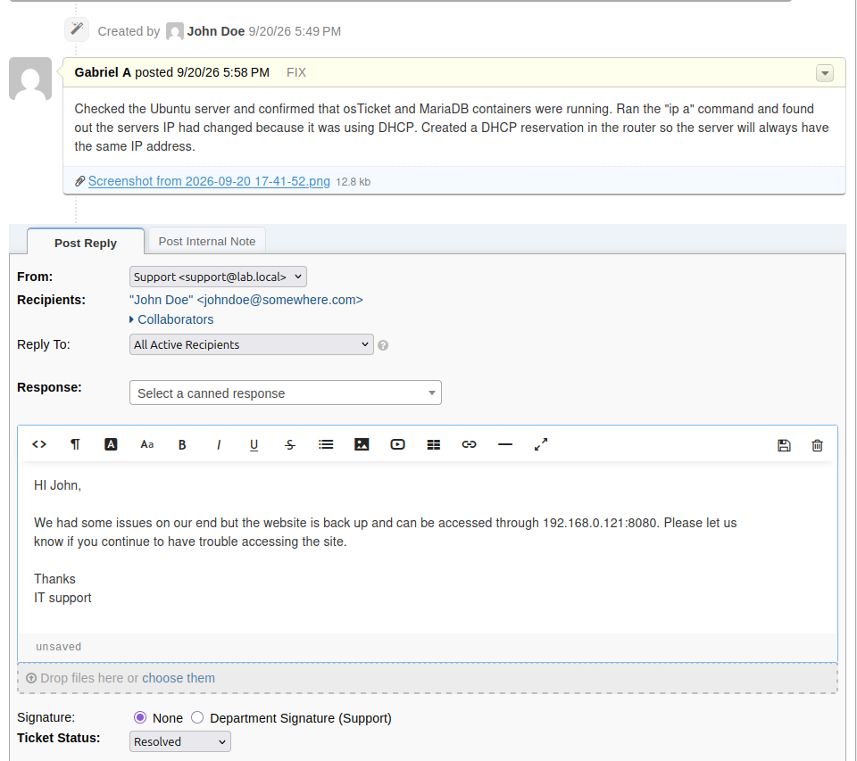
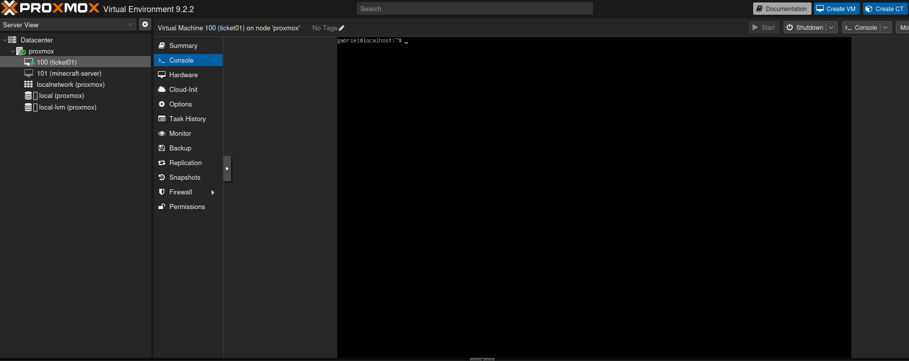

# Ticket #1 - Network Connectivity

## Problem

User reported that he was unable to access the help desk website using the previously saved address.

## Troubleshooting

- Checked the Ubuntu server.
- Verified that the osTicket and MariaDB containers were running.
- Checked the server's IP address.
- Identified that DHCP had caused the server's IP address to change.

## Root Cause

The Ubuntu server was using DHCP without a reservation. So when the server restarted, its IP address changed, causing the previously saved help desk address to no longer work.

## Resolution

Created a DHCP reservation in the Omada router so the server would retain the same IP address.

## Verification

Verified that the server was reachable at the reserved IP address and that the osTicket help desk was accessible again.

The user was notified that the help desk was available and the ticket was marked as resolved.

## Lab Environment

Ticket #1 was performed against the TICKET01 Ubuntu Server VM running in the Proxmox homelab.

