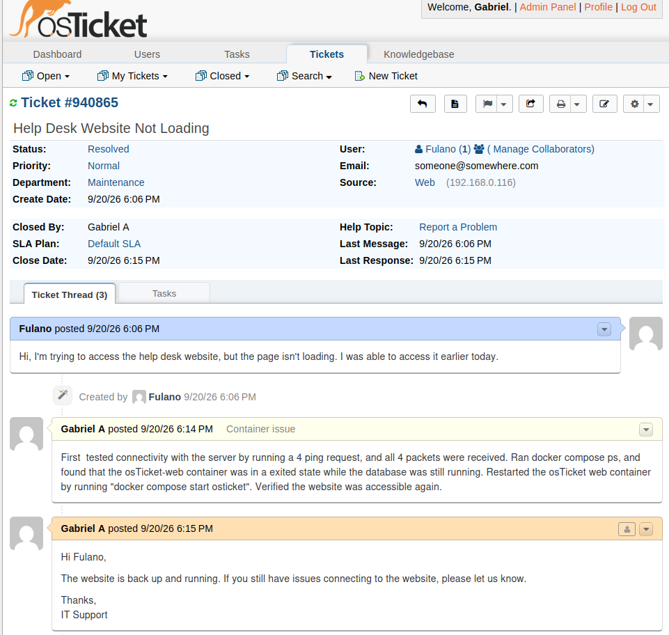

# Ticket #2 - Help Desk Website Not Loading

## Problem

User reported that the help desk website was not loading, despite being accessible earlier in the day.

## Troubleshooting

- Tested network connectivity to the Ubuntu server using four ping requests.
- Confirmed that all four packets were successfully received.
- Ran `docker compose ps` to inspect the application containers.
- Found that the osTicket web container was stopped while the MariaDB database container was still running.

## Root Cause

The osTicket web container had stopped, preventing users from accessing the help desk website. Network connectivity to the server and the database service were still operational.

## Resolution

Restarted the osTicket web container using:

```bash
docker compose start osticket
```

